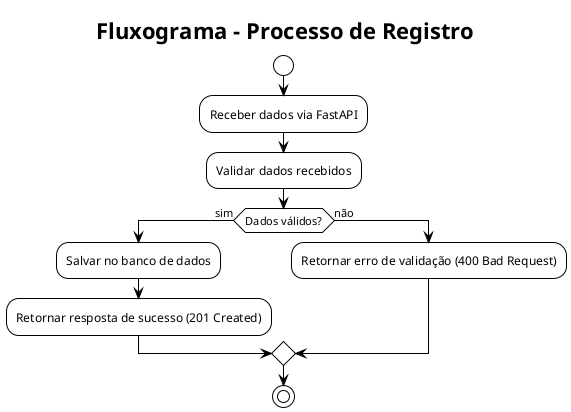
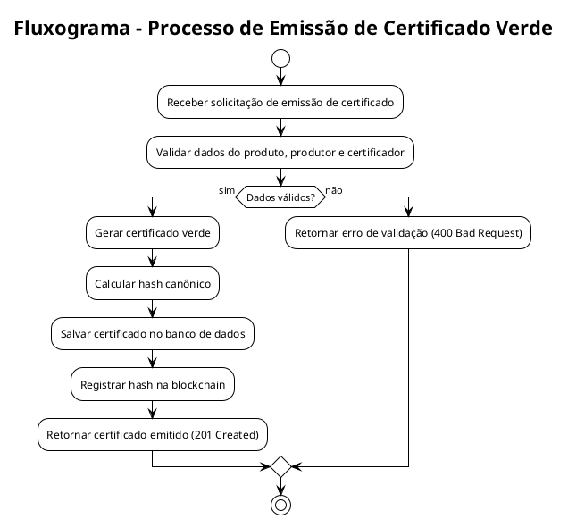
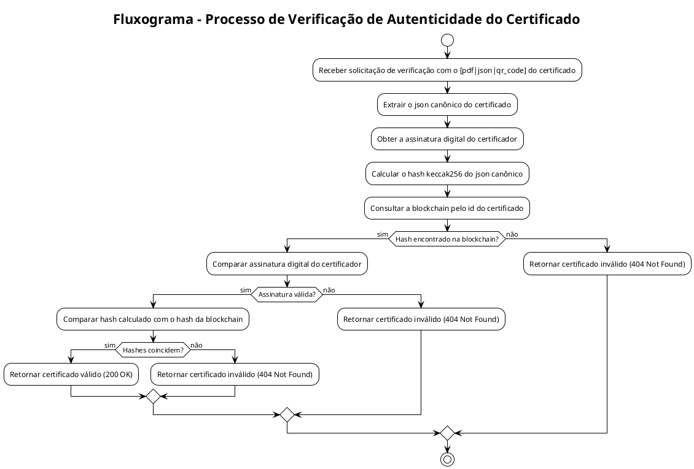
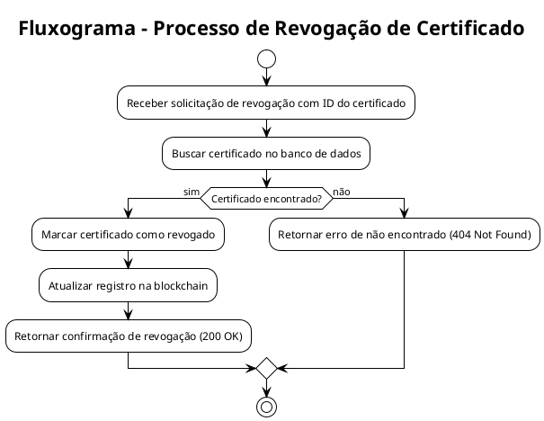

# ⚙️ Backend - CVB

Este ambiente contém os arquivos e configurações necessários para o desenvolvimento, teste e deploy do backend relacionado ao Certificado Verde Blockchain (CVB).

## 🗂️ Estrutura de Diretórios

```bash
backend/
├── README.md # Documentação do ambiente de backend (📍 Você está aqui)
├── Dockerfile # Dockerfile para construir a imagem do ambiente de backend
├── pyproject.toml # Configuração do Poetry para gerenciamento de dependências
├── poetry.lock # Arquivo de bloqueio de dependências do Poetry (gerado automaticamente)
├── .gitignore # Arquivo para ignorar arquivos e diretórios no Git
├── .pre-commit-config.yaml # Configuração do pre-commit para hooks de qualidade de código
│
├── src/ # Diretório contendo o código-fonte do backend
│   └── certificado-verde-blockchain/ # Pacote principal do backend
│
│
├── tests/ # Diretório contendo os testes automatizados do backend
│   ├── unit/ # Testes unitários
│   └── integration/ # Testes de integração
│
└── examples/ # Diretório contendo exemplos de uso do backend
```

Para navegar para os outros ambientes, utilize um dos links abaixo:

[📗 Certificado Verde Blockchain](../README.md) \
[🔗 Blockchain](blockchain/README.md) \
[🖥️ Frontend](frontend/README.md)

## 🧸 Modelos

Os modelos utilizados no backend são definidos utilizando Pydantic, que facilita a validação e serialização dos dados. Abaixo estão os principais modelos:

- 🧩 `ProductCategory`: `Enum`que determina o tipo de produto que está sendo certificado.
  - `Fruit`: Representa **frutas** e produtos derivados (ex: maçã, banana, suco de laranja).
  - `Grain`: Representa **grãos** e produtos derivados (ex: arroz, milho, trigo).
  - `Resource`: Representa **recursos naturais** (ex: madeira, água, minerais).
  - `Oil`: Representa **óleos** e produtos derivados (ex: óleo de palma, óleo de soja).
  - ... (outros tipos podem ser adicionados conforme necessário)

- 📏 `MeasurementUnit`: `Enum` que representa as unidades de medida utilizadas para quantificar produtos.
  - `kg`: Quilograma
  - `liters`: Litro
  - `tons`: Tonelada
  - ... (outras unidades podem ser adicionadas conforme necessário)

- ⚖️ `Quantity`: Representa a **quantidade** de um produto, incluindo valor e unidade de medida.

> `value: float` — valor numérico da quantidade (deve ser >= 0). \
> `unit: MeasurementUnit` — unidade de medida (ex: kg, litros, toneladas).

Exemplo de uso (JSON):

```json
{
    "value": 1500.5,
    "unit": "kg"
}
```

- 🧭 `Coordinates`: Representa as **coordenadas geográficas** de um local.

> `latitude: float` — latitude em graus (-90 a 90). \
> `longitude: float` — longitude em graus (-180 a 180). \

Exemplo de uso (JSON):

```json
{
    "latitude": -23.5505,
    "longitude": -46.6333
}
```

- 📍 `Location`: Representa a **localização geográfica** associada a um produto ou evento.

> `country: string` — país (ex: "Brasil"). \
> `state: string?` — estado ou província (opcional). \
> `city: string?` — cidade (opcional). \
> `coordinates: Coordinates` — coordenadas geográficas com latitude e longitude. \
Exemplo de uso (JSON):

```json
{
    "country": "Brasil",
    "state": "São Paulo",
    "city": "Campinas",
    "coordinates": {
        "latitude": -22.9056,
        "longitude": -47.0608
    }
}
```

- 🍌 `Product`: Representa o **produto** que é gerenciado pelo sistema, contendo informações de identificação, origem, quantidade e metadados usados para rastreabilidade, verificação de origem e cálculo de atributos ambientais.

> `id: UUID` — identificador único do produto. \
> `name: string` — nome do produto (**obrigatório**, comprimento > 0). \
> `description: string?` — descrição opcional. \
> `category: ProductCategory` — categoria ou tipo do produto, ("Fruta", "Grão", "Recurso", "Oleo", etc...). \
> `quantity: Quantity` — quantidade certificada (valor, unidade de medida). \
> `origin: Location` — origem geográfica ou local de produção. \
> `lot_number: string?` — número do lote para rastreabilidade. \
> `carbon_emission: float?` — emissões associadas (kg CO2e por unidade), >= 0. \
> `metadata: dict[string, any]?` — campos livres para extensões. \
> `tags: list[string]?` — etiquetas para busca e categorização. \

Exemplo de uso (JSON):

```json
{
    "id": "123e4567-e89b-12d3-a456-426614174000",
    "name": "Açaí Orgânico",
    "description": "Açaí orgânico colhido na Amazônia",
    "category": "Fruta",
    "quantity": {
        "value": 1000.5,
        "unit": "kg"
    },
    "origin": {
        "country": "Brasil",
        "state": "Pará",
        "city": "Belém",
        "coordinates": {
            "latitude": -1.4558,
            "longitude": -48.5039
        }
    },
    "lot_number": "L20240601",
    "carbon_emission": 250.75,
    "metadata": {
        "harvest_season": "2024",
        "certification_body": "Orgânico Brasil"
    },
    "tags": ["orgânico", "amazônia", "sustentável"]
}
```

- 🧩🪪 `DocumentType`: `Enum` que dtermina o tipo de documento que está sendo usado pelo produtor ou pelo auditor.

> `CPF`: Representa o **Cadastro de Pessoa Física**. \
> `CNPJ`: Representa o **Cadastro Nacional da Pessoa Jurídica**.
> `CREA`: Representa o **Conselho Regional de Engenharia e Agronomia**. \
> `CRBIO`: Representa o **Conselho Regional de Biologia**. \
> `INMETRO`: Representa o **Instituto Nacional de Metrologia, Qualidade e Tecnologia**. \
> `OTHER`: Representa outros tipos de documentos não especificados acima.

- 🪪 `Document`: Representa um documento de identificação do produtor ou do auditor. Pode ser **CPF**, para o caso de pessoa física, **CNPJ** para pessoa jurídica ou outros registros profissionais para o caso de *Auditor*.

> `type: DocumentType` — tipo do documento (CPF, CNPJ, CREA, CRBIO, INMETRO, OTHER). \
> `number: string` — número do documento (formato válido conforme o tipo). \
Exemplo de uso (JSON):

```json
{
    "type": "CNPJ",
    "number": "12.345.678/0001-90"
}
```

- 📞 `ContactInfo`: Representa os dados de contato de um produtor.

> `phone: string?` — número de telefone (formato internacional recomendado). \
> `email: string?` — endereço de email (formato válido). \
> `website: string?` — URL do site (formato válido). \
Exemplo de uso (JSON):

```json
{
    "phone": "+55 11 91234-5678",
    "email": "contato@exemplo.com",
    "website": "https://www.exemplo.com"
}
```

- 👨‍🌾 `Producer`: Representa o **produtor** para quem o certificado está sendo gerado. Contém informações de identificação, documentos, endereço e ...

> `id: UUID` — identificador único do produtor. \
> `name: string` — nome completo ou razão social (**obrigatório**, comprimento > 0). \
> `document`: Document — documento de identificação (CPF, CNPJ, etc...). \
> `address`: Location — endereço físico do produtor. \
> `car_code: string?` — código CAR (Cadastro Ambiental Rural), se aplicável. \
> `contact: ContactInfo` — informações de contato (telefone, email, website). \
> `metadata: dict[string, any]?` — campos livres para extensões. \

Exemplo de uso (JSON):

```json
{
    "id": "223e4567-e89b-12d3-a456-426614174001",
    "name": "Fazenda Boa Terra Ltda.",
    "document": {
        "type": "CNPJ",
        "number": "12.345.678/0001-90"
    },
    "address": {
        "country": "Brasil",
        "state": "Amazonas",
        "city": "Manaus",
        "coordinates": {
            "latitude": -3.1190,
            "longitude": -60.0217
        }
    },
    "car_code": "1234567890123",
    "contact": {
        "phone": "+55 92 99876-5432",
        "email": "contato@boaterra.com",
        "website": "https://www.boaterra.com"
    },
    "metadata": {
        "foundation_year": 1995,
        "certifications": ["ISO 14001", "Rainforest Alliance"]
    }
}
```

- 👮 `Auditor`: Representa o **auditor** responsável pela verificação do certificado.

> `id: UUID` — identificador único do auditor. \
> `name: string`- nome completo do auditor (**obrigatório**, comprimento > 0). \
> `document`: Document — documento de identificação (CREA, CRBIO, INMETRO, OTHER).

Exemplo de uso (JSON):

```json
{
    "id": "323e4567-e89b-12d3-a456-426614174002",
    "name": "João da Silva",
    "document": {
        "type": "CREA",
        "number": "1234567890"
    }
}
```

- 🏤 `Certifier`: A entidade que está conferindo o certificado.

> `id: UUID` — identificador único do certificador. \
> `name: string` — nome completo ou razão social do certificador (**obrigatório**, comprimento > 0). \
> `document`: Document — documento de identificação (CNPJ apenas). \
> `auditors: list[Auditor]` — lista de auditores associados ao certificador.

Exemplo de uso (JSON):

```json
{
    "id": "423e4567-e89b-12d3-a456-426614174003",
    "name": "Instituto de Certificação Sustentável",
    "document": {
        "type": "CNPJ",
        "number": "98.765.432/0001-21"
    },
    "auditors": [
        {
            "id": "323e4567-e89b-12d3-a456-426614174002",
            "name": "João da Silva",
            "document": {
                "type": "CREA",
                "number": "1234567890"
            }
        }
    ]
}
```

- ✳️ `Norm`: `Enum` que representa as normas e certificações ambientais que podem ser atendidas pelo produto.

> `ISO_14001`: Representa a norma **ISO 14001** para sistemas de gestão ambiental. \
> `RAINFOREST_ALLIANCE`: Representa a certificação **Rainforest Alliance**. \
> `FSC`: Representa a certificação **Forest Stewardship Council (FSC)**. \
> `LEED`: Representa a certificação **Leadership in Energy and Environmental Design (LEED)**. \
> `IBD_ORG`: Representa a certificação **IBD Orgânicos**.

- 🌎 `SustainabilityCriteria`: `Enum`com critérios de sustentabilidade atendidos pelo produto e produtor. O certificado precisa declarar o **motivo** pelo qual o produto é considerado sustentável.

> `ORGANIC`: Produto cultivado sem o uso de agrotóxicos ou fertilizantes sintéticos. \
> `LEGAL_ORIGIN`: Produto proveniente de áreas com documentação legal adequada. \
> `FOREST_MANAGEMENT_PLAN`: Produto proveniente de áreas manejadas conforme planos de manejo florestal sustentável. \
> `BIODIVERSITY_MAINTENANCE`: Produto que contribui para a manutenção da biodiversidade local. \
> `COMPLETE_TRACEABILITY`: Produto com rastreabilidade completa desde a origem até o consumidor final. \
> `EXPLOITATION_LIMITS`: Produto extraído respeitando os limites de exploração sustentável. \
> `WORKING_CONDITIONS`: Produto proveniente de operações que garantem condições de trabalho justas e seguras. \
> `VALID_ENVIRONMENTAL_LICENSES`: Produto de produtores que possuem todas as licenças ambientais necessárias e válidas.

- ✅ `AutenticityProof`: Representa as provas de autenticidade do certificado, garantindo sua validade e conformidade.

> `serial_code: string` — código serial único do certificado. \
> `qr_code_url: string?` — URL para o QR code que aponta para a verificação do certificado online. \
> `signature: string`— assinatura digital do certificador, a chave pública usada para verificar a autenticidade do certificado. \

Exemplo de uso (JSON):

```json
{
    "serial_code": "CVB-2024-000123",
    "qr_code_url": "https://certificados.cvb.org/verify/CVB-2024-000123",
    "signature": "MEUCIQDf5+Xl3..."
}
```

- 📜 `Certificate`: Representa o **certificado verde** emitido para um produto sustentável, contendo todas as informações relevantes sobre o produto, produtor, certificador, critérios de sustentabilidade e provas de autenticidade.

> `id: UUID` — identificador único do certificado. \
> `version: string` — versão do certificado (ex: "1.0"). \
> `product: Product` — informações detalhadas do produto certificado. \
> `producer: Producer` — informações do produtor do produto. \
> `certifier: Certifier` — informações do certificador responsável. \
> `norms_complied: list[Norm]` — lista de normas atendidas pelo produto. \
> `sustainability_criteria: list[SustainabilityCriteria]` — critérios de sustentabilidade atendidos. \
> `notes: string?` — observações adicionais (opcional). \
> `issued_at: datetime` — data e hora de emissão do certificado. \
> `valid_until: datetime?` — data de validade do certificado (opcional). \
> `last_audited_at: datetime?` — data da última auditoria realizada (opcional). \
> `authenticity_proof: AuthenticityProof` — provas de autenticidade do certificado. \
> `canonical_hash: string` — hash canônico do certificado para verificação na blockchain. \

Exemplo de uso (JSON):

```json
{
    "id": "523e4567-e89b-12d3-a456-426614174004",
    "version": "1.0",
    "product": { ... },
    "producer": { ... },
    "certifier": { ... },
    "norms_complied": ["ISO_14001", "RAINFOREST_ALLIANCE"],
    "sustainability_criteria": ["ORGANIC", "LEGAL_ORIGIN", "COMPLETE_TRACEABILITY"],
    "notes": "Certificado válido para exportação.",
    "issued_at": "2024-06-01T10:00:00Z",
    "valid_until": "2025-06-01T10:00:00Z",
    "last_audited_at": "2024-05-15T14:30:00Z",
    "authenticity_proof": { ... },
    "canonical_hash": "a3f5c8e9d7b6..."
}
```

- 💣 `CanonicalCertificate`: This is the exact JSON, with fixed and ordered fields, that will be serialized in UTF-8, converted to canonical JSON, hashed with keccak256 and stored in the blockchain.

> `id: string` — identificador único do certificado (repare que agora mudamos para tipos prmitivos). \
> `version: string` — versão do certificado (ex: "1.0"). \
> `product`: dict[string, any] — informações detalhadas do produto certificado. \
> &nbsp;&nbsp;&nbsp; `name: string` — nome do produto certificado. \
> &nbsp;&nbsp;&nbsp; `category: string` — categoria do produto certificado. \
> &nbsp;&nbsp;&nbsp; `quantity_value: float` — valor da quantidade certificada. \
> &nbsp;&nbsp;&nbsp; `quantity_unit: string` — unidade de medida da quantidade certificada. \
> &nbsp;&nbsp;&nbsp; `origin_country: string` — país de origem do produto. \
> &nbsp;&nbsp;&nbsp; `origin_state: string` — estado de origem do produto. \
> &nbsp;&nbsp;&nbsp; `origin_city: string` — cidade de origem do produto. \
> &nbsp;&nbsp;&nbsp; `origin_latitude: float` — latitude da origem do produto. \
> &nbsp;&nbsp;&nbsp; `origin_longitude: float` — longitude da origem do produto. \
> &nbsp;&nbsp;&nbsp; `lot_number: string` — número do lote do produto. \
> `producer`: dict[string, any] — informações do produtor do produto. \
> &nbsp;&nbsp;&nbsp; `name: string` — nome completo ou razão social do produtor. \
> &nbsp;&nbsp;&nbsp; `document_type: string` — tipo do documento do produtor. \
> &nbsp;&nbsp;&nbsp; `document_number: string` — número do documento do produtor. \
> &nbsp;&nbsp;&nbsp; `car_code: string` — código CAR do produtor. \
> &nbsp;&nbsp;&nbsp; `address_country: string` — país do endereço do produtor. \
> &nbsp;&nbsp;&nbsp; `address_state: string` — estado do endereço do produtor. \
> &nbsp;&nbsp;&nbsp; `address_city: string` — cidade do endereço do produtor. \
> &nbsp;&nbsp;&nbsp; `address_latitude: float` — latitude do endereço do produtor. \
> &nbsp;&nbsp;&nbsp; `address_longitude: float` — longitude do endereço do produtor. \
> `certifier`: dict[string, any] — informações do certificador responsável. \
> &nbsp;&nbsp;&nbsp; `name: string` — nome completo ou razão social do certificador. \
> &nbsp;&nbsp;&nbsp; `document_type: string` — tipo do documento do certificador. \
> &nbsp;&nbsp;&nbsp; `document_number: string` — número do documento do certificador. \
> &nbsp;&nbsp;&nbsp; `auditor_names: list[string]` — lista de nomes dos auditores associados ao certificador. \
> `norms_complied: list[string]` — lista de normas atendidas pelo produto. \
> `sustainability_criteria: list[string]` — critérios de sustentabilidade atendidos. \
> `issued_at: string` — data e hora de emissão do certificado em formato ISO 8601. \
> `valid_until: string` — data de validade do certificado em formato ISO 8601. \
> `serial_code: string` — código serial único do certificado.

Exemplo de uso (JSON):

```json
{
    "id": "523e4567-e89b-12d3-a456-426614174004",
    "version": "1.0",
    "product": {
        "name": "Açaí Orgânico",
        "category": "Fruta",
        "quantity_value": 1000.5,
        "quantity_unit": "kg",
        "origin_country": "Brasil",
        "origin_state": "Pará",
        "origin_city": "Belém",
        "origin_latitude": -1.4558,
        "origin_longitude": -48.5039,
        "lot_number": "L20240601"
    },
    "producer": {
        "name": "Fazenda Boa Terra Ltda.",
        "document_type": "CNPJ",
        "document_number": "12.345.678/0001-90",
        "car_code": "1234567890123",
        "address_country": "Brasil",
        "address_state": "Amazonas",
        "address_city": "Manaus",
        "address_latitude": -3.1190,
        "address_longitude": -60.0217
    },
    "certifier": {
        "name": "Instituto de Certificação Sustentável",
        "document_type": "CNPJ",
        "document_number": "98.765.432/0001-21",
        "auditor_names": ["João da Silva"]
    },
    "norms_complied": ["ISO_14001", "RAINFOREST_ALLIANCE"],
    "sustainability_criteria": ["ORGANIC", "LEGAL_ORIGIN", "COMPLETE_TRACEABILITY"],
    "issued_at": "2024-06-01T10:00:00Z",
    "valid_until": "2025-06-01T10:00:00Z",
    "serial_code": "CVB-2024-000123"
}
```

## 🏦🎲 Banco de Dados

O backend utiliza o banco de dados PostgreSQL para armazenar e gerenciar os dados relacionados aos certificados verdes, incluindo produtos, produtores, auditores, certificadores e certificados. A estrutura das tabelas é baseada nos modelos Pydantic definidos acima, com enums representados como tipos enumerados no banco de dados e objetos aninhados desnormalizados em colunas ou tabelas relacionadas quando apropriado.

### Tabelas Principais

- **products**
  - `id` (UUID, PRIMARY KEY)
  - `name` (VARCHAR, NOT NULL)
  - `description` (TEXT)
  - `category` (ENUM: Fruit, Grain, Resource, Oil, ...)
  - `quantity_value` (FLOAT, NOT NULL, >= 0)
  - `quantity_unit` (ENUM: kg, liters, tons, ...)
  - `origin_country` (VARCHAR, NOT NULL)
  - `origin_state` (VARCHAR)
  - `origin_city` (VARCHAR)
  - `origin_latitude` (FLOAT, -90 to 90)
  - `origin_longitude` (FLOAT, -180 to 180)
  - `lot_number` (VARCHAR)
  - `carbon_emission` (FLOAT, >= 0)
  - `metadata` (JSONB)
  - `tags` (TEXT[])

- **producers**
  - `id` (UUID, PRIMARY KEY)
  - `name` (VARCHAR, NOT NULL)
  - `document_type` (ENUM: CPF, CNPJ, CREA, CRBIO, INMETRO, OTHER)
  - `document_number` (VARCHAR, NOT NULL)
  - `address_country` (VARCHAR, NOT NULL)
  - `address_state` (VARCHAR)
  - `address_city` (VARCHAR)
  - `address_latitude` (FLOAT, -90 to 90)
  - `address_longitude` (FLOAT, -180 to 180)
  - `car_code` (VARCHAR)
  - `contact_phone` (VARCHAR)
  - `contact_email` (VARCHAR)
  - `contact_website` (VARCHAR)
  - `metadata` (JSONB)

- **auditors**
  - `id` (UUID, PRIMARY KEY)
  - `name` (VARCHAR, NOT NULL)
  - `document_type` (ENUM: CPF, CNPJ, CREA, CRBIO, INMETRO, OTHER)
  - `document_number` (VARCHAR, NOT NULL)

- **certifiers**
  - `id` (UUID, PRIMARY KEY)
  - `name` (VARCHAR, NOT NULL)
  - `document_type` (ENUM: CPF, CNPJ, CREA, CRBIO, INMETRO, OTHER)
  - `document_number` (VARCHAR, NOT NULL)

- **certifier_auditors** (tabela de junção para relacionar certificadores e auditores)
  - `certifier_id` (UUID, FOREIGN KEY to certifiers.id)
  - `auditor_id` (UUID, FOREIGN KEY to auditors.id)

- **certificates**
  - `id` (UUID, PRIMARY KEY)
  - `version` (VARCHAR, NOT NULL)
  - `product_id` (UUID, FOREIGN KEY to products.id)
  - `producer_id` (UUID, FOREIGN KEY to producers.id)
  - `certifier_id` (UUID, FOREIGN KEY to certifiers.id)
  - `norms_complied` (TEXT[])
  - `sustainability_criteria` (TEXT[])
  - `notes` (TEXT)
  - `issued_at` (TIMESTAMP, NOT NULL)
  - `valid_until` (TIMESTAMP)
  - `last_audited_at` (TIMESTAMP)
  - `authenticity_serial_code` (VARCHAR, NOT NULL)
  - `authenticity_qr_code_url` (VARCHAR)
  - `authenticity_signature` (TEXT)
  - `canonical_hash` (VARCHAR, NOT NULL)

## 🌐 Rotas RESTFul

O backend expõe uma API RESTful para interagir com os certificados verdes e seus componentes relacionados. Abaixo estão as principais rotas disponíveis:

### `[POST] /products/`

**Descrição**: Cria um novo produto no sistema. \
**Corpo da Requisição**: JSON representando o modelo `Product`. \
**Resposta**: JSON do produto criado com status HTTP 201 Created.

## `[GET] /products/`

**Descrição**: Recupera a lista de todos os produtos cadastrados no sistema. \
**Resposta**: Lista JSON de objetos `Product` com status HTTP 200 OK.

### `[GET] /products/{product_id}/`

**Descrição**: Recupera os detalhes de um produto específico pelo seu ID. \
**Parâmetros de URL**: `product_id` (UUID do produto). \
**Resposta**: JSON `Product` com status HTTP 200 OK.

### `[POST] /producers/`

**Descrição**: Cria um novo produtor no sistema. \
**Corpo da Requisição**: JSON representando o modelo `Producer`. \
**Resposta**: JSON do produtor criado com status HTTP 201 Created.

### `[GET] /producers/`

**Descrição**: Recupera a lista de todos os produtores cadastrados no sistema. \
**Resposta**: Lista JSON de objetos `Producer` com status HTTP 200 OK.

### `[GET] /producers/{producer_id}/`

**Descrição**: Recupera os detalhes de um produtor específico pelo seu ID. \
**Parâmetros de URL**: `producer_id` (UUID do produtor). \
**Resposta**: JSON `Producer` com status HTTP 200 OK.

### `[POST] /certifiers/`

**Descrição**: Cria um novo certificador no sistema. \
**Corpo da Requisição**: JSON representando o modelo `Certifier`. \
**Resposta**: JSON do certificador criado com status HTTP 201 Created.

### `[GET] /certifiers/`

**Descrição**: Recupera a lista de todos os certificadores cadastrados no sistema. \
**Resposta**: Lista JSON de objetos `Certifier` com status HTTP 200 OK.

### `[GET] /certifiers/{certifier_id}/`

**Descrição**: Recupera os detalhes de um certificador específico pelo seu ID. \
**Parâmetros de URL**: `certifier_id` (UUID do certificador). \
**Resposta**: JSON `Certifier` com status HTTP 200 OK.

### `[POST] /auditors/`

**Descrição**: Cria um novo auditor no sistema. \
**Corpo da Requisição**: JSON representando o modelo `Auditor`. \
**Resposta**: JSON do auditor criado com status HTTP 201 Created.

### `[GET] /auditors/`

**Descrição**: Recupera a lista de todos os auditores cadastrados no sistema. \
**Resposta**: Lista JSON de objetos `Auditor` com status HTTP 200 OK.

### `[GET] /auditors/{auditor_id}/`

**Descrição**: Recupera os detalhes de um auditor específico pelo seu ID. \
**Parâmetros de URL**: `auditor_id` (UUID do auditor). \
**Resposta**: JSON `Auditor` com status HTTP 200 OK.

### `[POST] /certificates/`

**Descrição**: Cria um novo certificado verde no sistema. \
**Corpo da Requisição**: JSON representando o modelo `Certificate`. \
**Resposta**: JSON do certificado criado com status HTTP 201 Created.

### `[GET] /certificates/{certificate_id}/`

**Descrição**: Recupera os detalhes de um certificado específico pelo seu ID. \
**Parâmetros de URL**: `certificate_id` (UUID do certificado). \
**Resposta**: JSON `Certificate` com status HTTP 200 OK.

### `[GET] /certificates/verify/{serial_code}/`

**Descrição**: Verifica a autenticidade de um certificado pelo código serial. \
**Parâmetros de URL**: `serial_code` (código serial do certificado). \
**Resposta**: JSON com detalhes de verificação (ex: válido/inválido) com status HTTP 200 OK.

### `[POST] /certificates/{certificate_id}/revoke/`

**Descrição**: Revoga um certificado específico pelo seu ID. \
**Parâmetros de URL**: `certificate_id` (UUID do certificado). \
**Resposta**: JSON confirmando a revogação com status HTTP 200 OK.

## 🫧 Contextos Delimitados

O backend do Certificado Verde Blockchain é organizado em vários contextos delimitados para garantir uma arquitetura limpa e modular. Cada contexto é responsável por um conjunto específico de funcionalidades relacionadas ao domínio do sistema. Abaixo estão os principais contextos delimitados:

- 🍌 `Products` **Gestão de Produtos**: Responsável por todas as operações relacionadas aos produtos certificados, incluindo criação, atualização, exclusão e consulta de produtos. Este contexto lida com a validação dos dados do produto e garante que todas as informações necessárias estejam presentes para a emissão do certificado.

- 👨‍🌾  `Producers` **Gestão de Produtores**: Encarregado de gerenciar os produtores que solicitam certificados verdes. Isso inclui o cadastro, atualização e consulta de informações dos produtores, bem como a validação dos documentos apresentados.

- 👮  `Auditors and Certifiers` **Gestão de Auditores e Certificadores**: Focado na administração dos auditores responsáveis pela verificação dos certificados. Este contexto cuida do cadastro, atualização e consulta de auditores, garantindo que apenas profissionais qualificados possam atuar na validação dos certificados.

- 📜 `Certificates` **Emissão e Gestão de Certificados**: Centraliza todas as operações relacionadas à emissão, revogação e verificação dos certificados verdes. Este contexto é responsável por garantir a integridade dos dados do certificado, calcular o hash canônico para armazenamento na blockchain e fornecer mecanismos para verificação da autenticidade dos certificados.

## ↖️ Fluxogramas

A seguir estão os fluxogramas que ilustram os principais processos do backend do Certificado Verde Blockchain:

### 🏭 Processo de Registro de [ Produto | Produtor | Certificador | Auditor ]



### 📜 Processo de Emissão de Certificado Verde



### 🔍 Processo de Verificação de Autenticidade do Certificado



### 🛑 Processo de Revogação de Certificado



## 🧪 Testes Automatizados

O backend do Certificado Verde Blockchain possui uma suíte abrangente de testes automatizados para garantir a qualidade e a confiabilidade do código. A seguir estão os principais tipos de testes implementados:

- 🧩 Testes Unitários: Focados em testar individualmente os componentes e funções do sistema, garantindo que cada unidade de código funcione conforme o esperado. Utilizamos o framework `pytest` para escrever e executar esses testes.

- 🔄️ Testes de Integração: Verificam a interação entre diferentes componentes do sistema, como a comunicação com o banco de dados e a integração com a blockchain. Esses testes garantem que os módulos funcionem corretamente quando combinados.
